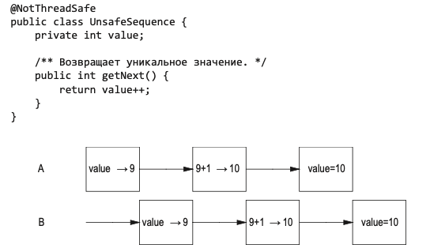
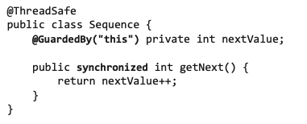

Every thread has self programming counter, stack and local variables. They have equal access to 
memory address space, work in concurrency, can access to variables or change them. Without 
synchronization which provides access coordination to shared data, threads can change variables 
which are used by another threads with unpredictable result.

Example 1 - unsafe/safe increment operation \

The previous picture shows unsafe increment operation. The increment operation consists of three 
separate operations:
- read value;
- increment value;
- record a new value.

A two thread can read value at the same time, increment it and return the same value. This 
example illustrates problem which names "race condition".
> Race condition - flaw in the system which characterized by different result when system 
> attempts to perform two or more operations at the same time.

The next picture shows safe increment operation where access to variable which have increment
synchronized by specific keyword "synchronized". \

<!-- The next chapter is 1.3.2 page number 43 -->